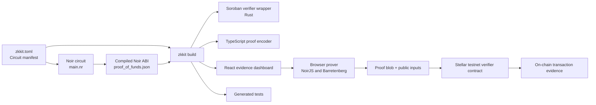
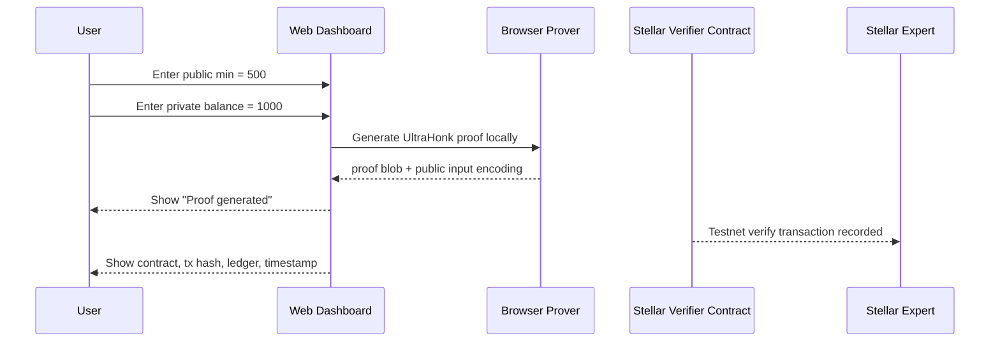
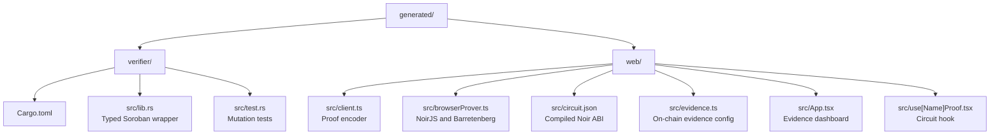

# Stellar ZK Kit

**ABI-aware code generation and verification scaffolding for Noir-based ZK applications on Stellar.**

Stellar ZK Kit is a developer-focused integration layer for teams building zero-knowledge workflows on Stellar. It does not replace Noir, Barretenberg, or Soroban. Instead, it connects them at the points where production prototypes usually become fragile: ABI interpretation, public input ordering, field encoding, proof byte layout, verifier wrapper generation, browser proving, and on-chain evidence presentation.

The toolkit starts from a `zkkit.toml` manifest and a compiled Noir ABI. From those inputs it generates a typed Soroban verifier wrapper, TypeScript proof encoding helpers, a React/Vite evidence dashboard, and regression tests that make public-input mismatches visible early. The goal is to turn a ZK circuit into a reproducible Stellar-facing proof pipeline, not a loose collection of hand-wired scripts.

The included proof-of-funds demo shows the intended developer workflow end to end. A user proves that a private balance satisfies a public minimum. The dashboard receives `min = 500` as a public input and `balance = 1000` as a private witness. The browser generates a real UltraHonk proof with NoirJS and Barretenberg, while the UI displays Stellar testnet evidence for the corresponding verifier transaction.

This repository should be read as infrastructure for ZK application developers: it captures repeatable integration conventions around Noir, Barretenberg UltraHonk, and Soroban so downstream apps can reuse them without copy-pasting byte packing logic or manually reconstructing verifier calls.

The included demo proves a practical statement:

> A private balance is greater than or equal to a public minimum, without revealing the private balance.

For the live demo:

```text
public input:  min = 500
private input: balance = 1000
ZK statement:  balance >= min
```

## Why Build This

Building a ZK application on Stellar requires several independently correct layers to agree on the exact same data model. The Noir circuit defines private and public inputs. Barretenberg produces proof and verifying-key artifacts with backend-specific formats. Soroban receives byte arrays and public inputs that must be packed exactly as the verifier expects. The frontend must generate proofs locally without accidentally exposing private witness data or presenting local proof generation as on-chain verification.

Those boundaries are easy to get wrong. A single mismatch in field order, integer width, endianness, proof byte layout, or testnet evidence handling can make a valid proof fail, or worse, make a demo appear verified when it is only locally generated.

Stellar ZK Kit standardizes those integration conventions. It gives developers a manifest-driven path from circuit ABI to contract wrapper, browser client, proof dashboard, and tests, with public input encoding treated as a first-class contract between all layers.

## What It Delivers

| Layer | Generated or Provided | Purpose |
| --- | --- | --- |
| Circuit manifest | `zkkit.toml` | Declares circuit name, backend, source, and public input order. |
| ABI inspection | `src/abi.ts` | Extracts public and private parameters from the compiled Noir ABI. |
| Soroban verifier wrapper | `generated/verifier/src/lib.rs` | Packs public inputs and calls the deployed UltraHonk verifier. |
| TypeScript client | `generated/web/src/client.ts` | Encodes public inputs and proof bytes into the expected verifier format. |
| React proof hook | `generated/web/src/use[Name]Proof.tsx` | Provides circuit-specific proving integration for the generated dashboard. |
| Browser prover | `generated/web/src/browserProver.ts` | Runs NoirJS and Barretenberg UltraHonk in the browser. |
| Evidence dashboard | `generated/web/src/App.tsx` | Shows public input, private witness handling, proof output, and on-chain evidence. |
| Test coverage | `generated/verifier/src/test.rs` and repo tests | Detects mutated public inputs, ABI mismatch, and codegen regressions. |

## Technology Stack

| Area | Stack |
| --- | --- |
| Circuit language | Noir |
| Proving system | Barretenberg UltraHonk |
| Transcript hash | Keccak |
| Smart contract layer | Stellar Soroban |
| Browser proof demo | NoirJS, Barretenberg `bb.js`, React, Vite |
| CLI and code generation | TypeScript, Commander, Handlebars, Zod |
| Verification target | Stellar testnet |

## Implementation Status

| Capability | Status |
| --- | --- |
| CLI manifest parsing and code generation | Implemented |
| ABI public/private input extraction | Implemented |
| Public input order cross-checking | Implemented |
| Soroban verifier wrapper generation | Implemented |
| TypeScript proof encoder generation | Implemented |
| Browser proof generation | Implemented with NoirJS and Barretenberg |
| On-chain testnet evidence | Verified on Stellar testnet |
| Public demo deployment | Deployed on Vercel |

## System Architecture



## Proof-of-Funds Workflow



## What ZK Is Doing

The circuit receives two values:

- `min`: public threshold visible to the verifier.
- `balance`: private witness known only to the prover.

The proof convinces the verifier that:

```text
balance >= min
```

without revealing the private value `balance`.

In the demo, the browser proves that `1000 >= 500`. The verifier and dashboard only need the proof and public input. The private witness stays local.

## Live Demo Walkthrough

1. Open https://stellar-zk-kit-demo.vercel.app.
2. Enter public input `min = 500`.
3. Enter private witness `balance = 1000`.
4. Click **Generate proof**.
5. Confirm the dashboard shows **Proof generated**.
6. Inspect the proof blob and public input table.
7. Inspect the on-chain evidence section.
8. Open the Stellar Expert transaction link to verify the testnet transaction.

Expected evidence:

| Field | Value |
| --- | --- |
| Network | Stellar Testnet |
| Status | SUCCESS |
| Ledger | `3375063` |
| Verifier contract | `CAKL7ZRKWCGYGII4FF4EZND2XHBI6IUOR77W7AGE3VKYXHUJSEPIGQKB` |
| Transaction hash | `9acc98a09320f4a8242d50bddae49e7ab79c4d0b67319f3486362eb769a82446` |
| Confirmed at | `2026-07-01 07:13:33 UTC` |

## Repository Structure

```text
stellar-zk-kit/
  src/
    abi.ts                 ABI extraction and public/private input discovery
    build.ts               Build orchestration and dashboard generation
    cli.ts                 zkkit CLI
    codegen.ts             Template rendering
    compile.ts             nargo/bb integration helpers
    config.ts              zkkit.toml schema and parsing
  templates/
    verifier.rs.hbs        Soroban verifier wrapper template
    client.ts.hbs          TypeScript encoder template
    hook.tsx.hbs           React hook template
    dashboard/             Vite evidence dashboard template
  lib/
    src/range.nr           Reusable Noir range primitive
  examples/
    proof_of_funds/
      src/main.nr          Demo circuit
      zkkit.toml           Demo manifest
      DEPLOYMENT.md        Testnet evidence and reproduction notes
      verify.sh            Testnet verification helper
      target/              Compiled ABI, proof, public inputs, verifying key
  test/
    abi.test.ts
    build.test.ts
    codegen.test.ts
    primitives.test.ts
  .local-demo/
    web/                   Generated dashboard used for the public demo
  demo-video/
    stellar_zk_kit_demo_final.mp4
```

## Generated Output Structure



Plain generated tree:

```text
generated/
  verifier/
    Cargo.toml
    src/
      lib.rs
      test.rs
  web/
    index.html
    package.json
    vite.config.ts
    src/
      App.tsx
      browserProver.ts
      circuit.json
      client.ts
      evidence.ts
      main.tsx
      styles.css
      use[Name]Proof.tsx
```

## Example Circuit

The demo circuit is intentionally small so reviewers can inspect the privacy boundary quickly.

```rust
use dep::stellar_zk_kit_primitives::range;

fn main(min: pub u64, balance: u64) {
    range::assert_range(balance as Field, min, 18_446_744_073_709_551_615);
}
```

The public input order is declared in `examples/proof_of_funds/zkkit.toml`:

```toml
[public_inputs]
order = ["min"]
min = { type = "u64" }
```

The generator cross-checks this order against the compiled Noir ABI when `--abi` is supplied.

## Install and Verify

```bash
npm install
npm test
npm run typecheck
npm run build
```

Current verified state:

| Check | Result |
| --- | --- |
| Unit/codegen tests | 5 files, 31 tests passing |
| TypeScript typecheck | Passing |
| Package build | Passing |
| Generated dashboard build | Passing |
| Public browser smoke | Proof generation succeeds; on-chain evidence visible |

## Build the Demo Locally

Generate the proof-of-funds demo output:

```bash
node dist/src/cli.js build \
  --no-compile \
  --config examples/proof_of_funds/zkkit.toml \
  --abi examples/proof_of_funds/target/proof_of_funds.json \
  --out .local-demo
```

Run the generated dashboard:

```bash
cd .local-demo/web
npm install
npm run dev
```

## Reproduce Testnet Verification

The deployed verifier uses Barretenberg UltraHonk with Keccak transcript settings.

Important proof-generation flags:

```bash
bb write_vk -b target/proof_of_funds.json -o target \
  --scheme ultra_honk --oracle_hash keccak --output_format bytes_and_fields

bb prove -b target/proof_of_funds.json -w target/proof_of_funds.gz -o target \
  --scheme ultra_honk --oracle_hash keccak --output_format bytes_and_fields
```

Invoke the deployed verifier:

```bash
stellar contract invoke \
  --id CAKL7ZRKWCGYGII4FF4EZND2XHBI6IUOR77W7AGE3VKYXHUJSEPIGQKB \
  --source deployer \
  --network testnet \
  --send=yes \
  -- verify_proof \
  --public_inputs-file-path target/public_inputs \
  --proof_bytes-file-path target/proof
```

On this Windows development machine, `nargo`, `bb`, and `stellar` were run through WSL.

## Public Input Encoding

| Type | Encoding |
| --- | --- |
| `field` / `bytes32` | 32-byte big-endian field element |
| `u64` | Packed into the last 8 bytes of a 32-byte field |
| `u32` | Packed into the last 4 bytes of a 32-byte field |
| `bool` | Packed into the last byte of a 32-byte field |

The generated client and verifier wrapper use the same declared public input order so the proof blob matches the contract expectation.

## CLI Reference

Scaffold a new example:

```bash
node dist/src/cli.js init proof_of_funds
```

Build generated artifacts:

```bash
node dist/src/cli.js build --config zkkit.toml --out generated
```

Build without compiling Noir, while still cross-checking against an ABI:

```bash
node dist/src/cli.js build --no-compile --abi target/proof_of_funds.json
```

Regenerate only the React proving hook:

```bash
node dist/src/cli.js gen-react --config zkkit.toml --out generated
```

## Security and Trust Boundaries

- Private witnesses are entered in the dashboard and used locally by the browser prover.
- The dashboard does not claim live verification unless real contract and transaction evidence is configured.
- The generated verifier wrapper depends on the deployed UltraHonk verifier contract and its verifying key.
- Public input order must match the Noir ABI; the build step cross-checks this when an ABI is available.
- The demo is a developer proof-of-concept, not a wallet, custody, or production compliance product.
- Confidential Tokens are not generated by this toolkit; projects that need confidential payments should integrate them separately.

## Current Limitations

- UltraHonk is the only supported proving backend.
- The included deployment is on Stellar testnet, not mainnet.
- The browser dashboard is optimized for demo and developer verification, not production account management.
- On-chain evidence in the generated demo is configured for `examples/proof_of_funds` only.

## Relation to `zkballot`

Stellar ZK Kit extracts reusable integration patterns from the `zkballot` style of application: static verifying-key verifier contracts, canonical field encoding, typed client helpers, browser-facing proof UX, and testnet verification evidence. The goal is to make those conventions reusable for proof-of-funds, private eligibility checks, zk auctions, and other Stellar applications without copy-pasting fragile glue code.

## Submission Links

| Item | Link |
| --- | --- |
| Live web demo | https://stellar-zk-kit-demo.vercel.app |
| Demo video | https://youtu.be/GhDmxCI3Ca4 |
| Stellar testnet transaction | https://stellar.expert/explorer/testnet/tx/9acc98a09320f4a8242d50bddae49e7ab79c4d0b67319f3486362eb769a82446 |
| Example circuit | `examples/proof_of_funds/src/main.nr` |
| Testnet deployment notes | `examples/proof_of_funds/DEPLOYMENT.md` |
